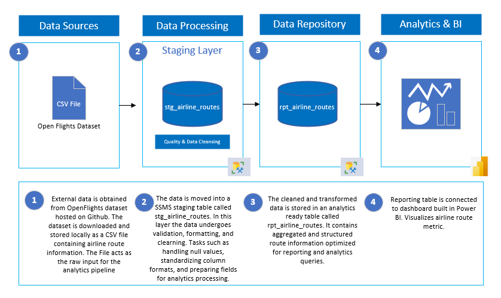
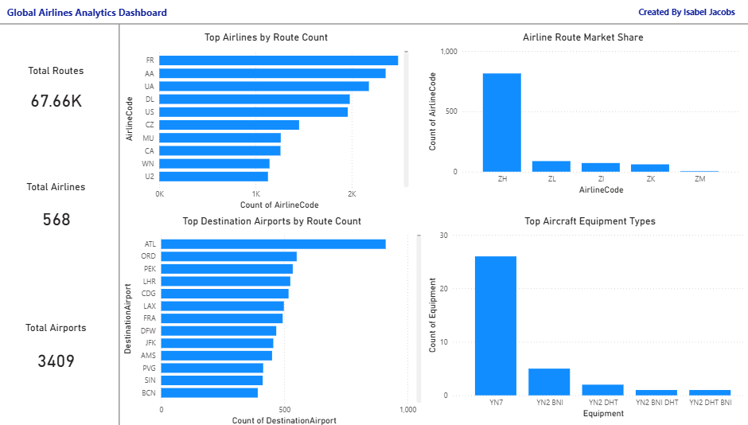

# Airline Route Analytics Pipeline

This project demonstrates a simple data analytics pipeline built using SQL and Power BI to analyze global airline route data.

The project transforms raw airline route data into an analytics-ready dataset and visualizes key insights through a dashboard.

---

## Architecture



The pipeline follows a simple structure:

1. **Data Source**  
   Airline route dataset downloaded from GitHub and stored as a CSV file.

2. **Data Processing (Staging Layer)**  
   Raw data imported into SQL Server staging table:

   `stg_airline_routes`

3. **Data Repository (Reporting Layer)**  
   Cleaned and structured analytics dataset:

   `rpt_airline_routes`

4. **Analytics & BI**  
   Power BI dashboard used to visualize airline route insights.

---

## Example SQL Query

```sql
SELECT TOP 10
    SourceAirport,
    COUNT(*) AS RouteCount
FROM rpt_airline_routes
GROUP BY SourceAirport
ORDER BY RouteCount DESC;
```


---

## Dashboard



---

## Technologies Used

- SQL Server
- SQL Server Management Studio (SSMS)
- Power BI
- GitHub